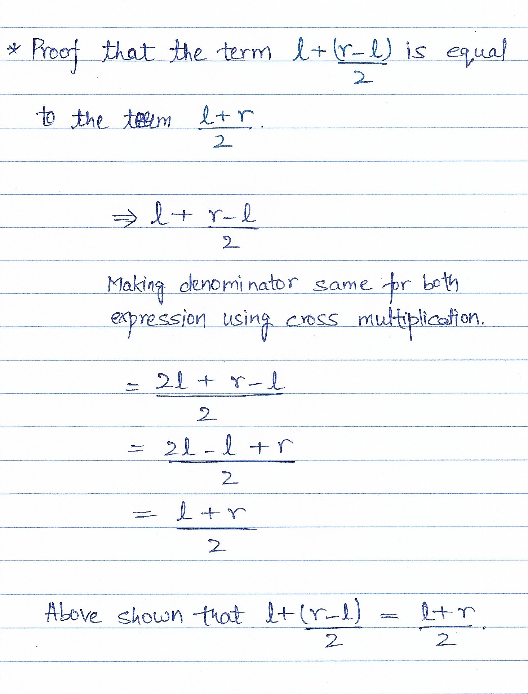

### Algorithms

# Table of Contents

| Section | Title |
| ------- | ----- |
| 01 | [Binary Search](#01) |
| 02 | [Dynamic Programming](#02) |
| 03 | [Segment Tree](#03) |


<a id="01"></a>
# Binary Search

[Reference Link](https://www.topcoder.com/community/competitive-programming/tutorials/binary-search)

Only works if the ordered data is either constantly increasing or decreasing (non-changing is fine too).
- If the condition is viewed as a boolean return, then if the data looks like this (FFFFFFFTTTTTTT), then binary will work.

```python
binary_search():
    lo = min_possible_val - 1
    hi = max_possible_val + 1

    while lo != hi - 1:                 # lo and hi will converge until they are next to each other
        mid = lo + (hi - lo) // 2       # same as (lo + hi) // 2, but prevents integer overflow

        if f(mid) == True:
            hi = mid                    # can also set this to lo based off of needs
        else:
            lo = mid

    return lo                           # return lo or hi based off of needs
```

Time complexity - O(log n)

## Calculating `mid`



<a id="02"></a>
# Dynamic Programming (Memoization)

## Popular Problems

### Knapsack

Given a knapsack and an array of items with weights, determine if you can fill the knapsack completely (each item can only be chosen once).

```python
knapsack(items, maxSize):
    n = len(items)
    dp = [0] * (maxSize + 1)
    
    dp[0] = 1
    for i in range(n):
        for j in range(maxSize, items[i]-1, -1):
            dp[j] |= dp[j - items[i]]                   # bitwise OR

    return dp[maxSize]
```

Time complexity - O(n\*m) where n is item length, m is maxSize <br/>
Space complexity - O(m)

NOTE: If items can be chosen multiple times, then flip the direction of the second loop.

<a id="03"></a>
# Segment Tree


