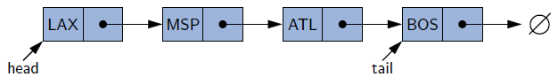
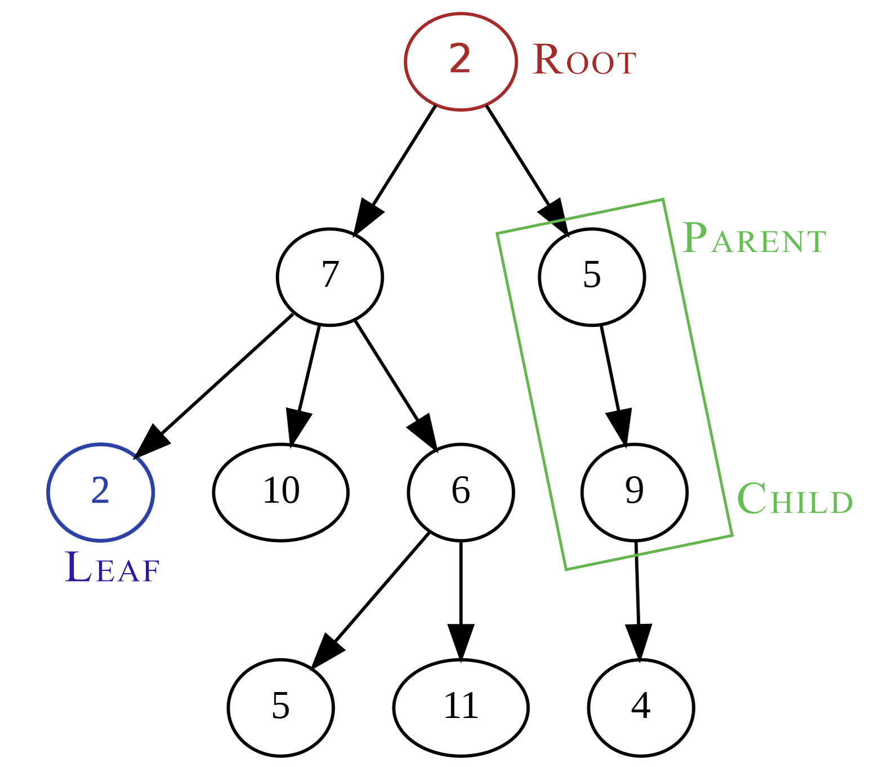

### CSCI-UA.102: Data Structures

#### Prof. Evan Korth, Spring 2022

_PROGRAMMING LANGUAGE IS JAVA_

# Table of contents

# Table of Contents

| Section | Title |
| ------- | ----- |
| 01 | [Intro](#01) |
| 02 | [Generics](#02) |
| 03 | [Big O](#03) |
| 04 | [Linked Lists](#04) |
| 05 | [Stacks](#05) |
| 06 | [Queues](#06) |
| 07 | [Intro to Trees](#07) |
| 08 | [BST](#08) |
| 09 | Heap |
| 10 | Sorting |
| 11 | AVL Trees |
| 12 | Hashmaps |

<a id="01"></a>
# Intro

- __Abstract data type (ADT):__ A data item that is defined by the operations/methods that can be performed on it, regardless of how these operations are implemented.

<a id="02"></a>
# Generics

[Reference Link](https://www.reddit.com/r/learnjava/comments/2u0ab9/really_confused_about_generics_can_somebody_eli5/)

Imagine you have a class called Bucket and you want to put something in that bucket, in this case water:
```java
public class Bucket {

    private Water content;

    public Bucket(Water content) {
        this.content = content;
    }

    public Water getContent() {
        return content;
    }
```

If you now create a Bucket you can easily fill it with Water.
```java
Water water = new Water();
Bucket waterBucket = new Bucket(water);
```

But what if you want to fill the Bucket with Sand? It wouldn't be possible because your Bucket only accepts Water.

To make your Bucket more flexible you can use Generics, so let's add Generics to the Bucketclass:
```java
public class Bucket <T>{

    private T content;

    public Bucket(T content) {
        this.content = content;
    }

    public T getContent() {
        return content;
    }
```

T stands for Generic which tells the compiler what type of content the bucket will have.

So if you now want to fill the Bucket with sand you can use this:
```java
Sand sand = new Sand();
Bucket<Sand> sandBucket = new Bucket<>(sand);
```

or with Water like this:
```java
Water water = new Water();
Bucket<Water> waterBucket = new Bucket<>(water)
```

A good example is __Lists__ in Java where you have to define the Type of the Entries.

<a id="03"></a>
# Big O Notation

A way to quantify the size of a program
- __Time complexity__ is how long an algorithm will take to run.
- __Space complexity__ is how much memory is being taken up.


Just because two operations have the same level of complexity doesn't mean they run on the same time.

<a id="04"></a>
# Linked List

## Singly Linked List



Units/nodes are scattered through the memory, making a list size indefinite.

Each node holds a piece of data, and has a pointer to the next node in the sequence. Last node 
points to null.
- __Accessing__ time complexity is O(n)
- __Add First__ time complexity is O(1)
- __Add Last__ time complexity is O(n)
- __Add Middle__ time complexity is O(n)
- __Remove First__ time complexity is O(1)

Removing last is inefficient since the whole list has to be traversed.

<details>
    <summary>Implementation</summary>

```java
public class SinglyLinkedList<E> implements Cloneable {
  //---------------- nested Node class ----------------
  /**
   * Node of a singly linked list, which stores a reference to its
   * element and to the subsequent node in the list (or null if this
   * is the last node).
   */
  private static class Node<E> {

    /** The element stored at this node */
    private E element;            // reference to the element stored at this node

    /** A reference to the subsequent node in the list */
    private Node<E> next;         // reference to the subsequent node in the list

    /**
     * Creates a node with the given element and next node.
     *
     * @param e  the element to be stored
     * @param n  reference to a node that should follow the new node
     */
    public Node(E e, Node<E> n) {
      element = e;
      next = n;
    }

    // Accessor methods
    /**
     * Returns the element stored at the node.
     * @return the element stored at the node
     */
    public E getElement() { return element; }

    /**
     * Returns the node that follows this one (or null if no such node).
     * @return the following node
     */
    public Node<E> getNext() { return next; }

    // Modifier methods
    /**
     * Sets the node's next reference to point to Node n.
     * @param n    the node that should follow this one
     */
    public void setNext(Node<E> n) { next = n; }
  } //----------- end of nested Node class -----------

  // instance variables of the SinglyLinkedList
  /** The head node of the list */
  private Node<E> head = null;               // head node of the list (or null if empty)

  /** The last node of the list */
  private Node<E> tail = null;               // last node of the list (or null if empty)

  /** Number of nodes in the list */
  private int size = 0;                      // number of nodes in the list

  /** Constructs an initially empty list. */
  public SinglyLinkedList() { }              // constructs an initially empty list

  // access methods
  /**
   * Returns the number of elements in the linked list.
   * @return number of elements in the linked list
   */
  public int size() { return size; }

  /**
   * Tests whether the linked list is empty.
   * @return true if the linked list is empty, false otherwise
   */
  public boolean isEmpty() { return size == 0; }

  /**
   * Returns (but does not remove) the first element of the list
   * @return element at the front of the list (or null if empty)
   */
  public E first() {             // returns (but does not remove) the first element
    if (isEmpty()) return null;
    return head.getElement();
  }

  /**
   * Returns (but does not remove) the last element of the list.
   * @return element at the end of the list (or null if empty)
   */
  public E last() {              // returns (but does not remove) the last element
    if (isEmpty()) return null;
    return tail.getElement();
  }

  // update methods
  /**
   * Adds an element to the front of the list.
   * @param e  the new element to add
   */
  public void addFirst(E e) {                // adds element e to the front of the list
    head = new Node<>(e, head);              // create and link a new node
    if (size == 0)
      tail = head;                           // special case: new node becomes tail also
    size++;
  }

  /**
   * Adds an element to the end of the list.
   * @param e  the new element to add
   */
  public void addLast(E e) {                 // adds element e to the end of the list
    Node<E> newest = new Node<>(e, null);    // node will eventually be the tail
    if (isEmpty())
      head = newest;                         // special case: previously empty list
    else
      tail.setNext(newest);                  // new node after existing tail
    tail = newest;                           // new node becomes the tail
    size++;
  }

  /**
   * Removes and returns the first element of the list.
   * @return the removed element (or null if empty)
   */
  public E removeFirst() {                   // removes and returns the first element
    if (isEmpty()) return null;              // nothing to remove
    E answer = head.getElement();
    head = head.getNext();                   // will become null if list had only one node
    size--;
    if (size == 0)
      tail = null;                           // special case as list is now empty
    return answer;
  }

  @SuppressWarnings({"unchecked"})
  public boolean equals(Object o) {
    if (o == null) return false;
    if (getClass() != o.getClass()) return false;
    SinglyLinkedList other = (SinglyLinkedList) o;   // use nonparameterized type
    if (size != other.size) return false;
    Node walkA = head;                               // traverse the primary list
    Node walkB = other.head;                         // traverse the secondary list
    while (walkA != null) {
      if (!walkA.getElement().equals(walkB.getElement())) return false; //mismatch
      walkA = walkA.getNext();
      walkB = walkB.getNext();
    }
    return true;   // if we reach this, everything matched successfully
  }

  @SuppressWarnings({"unchecked"})
  public SinglyLinkedList<E> clone() throws CloneNotSupportedException {
    // always use inherited Object.clone() to create the initial copy
    SinglyLinkedList<E> other = (SinglyLinkedList<E>) super.clone(); // safe cast
    if (size > 0) {                    // we need independent chain of nodes
      other.head = new Node<>(head.getElement(), null);
      Node<E> walk = head.getNext();      // walk through remainder of original list
      Node<E> otherTail = other.head;     // remember most recently created node
      while (walk != null) {              // make a new node storing same element
        Node<E> newest = new Node<>(walk.getElement(), null);
        otherTail.setNext(newest);     // link previous node to this one
        otherTail = newest;
        walk = walk.getNext();
      }
    }
    return other;
  }

  public int hashCode() {
    int h = 0;
    for (Node walk=head; walk != null; walk = walk.getNext()) {
      h ^= walk.getElement().hashCode();      // bitwise exclusive-or with element's code
      h = (h << 5) | (h >>> 27);              // 5-bit cyclic shift of composite code
    }
    return h;
  }

  /**
   * Produces a string representation of the contents of the list.
   * This exists for debugging purposes only.
   */
  public String toString() {
    StringBuilder sb = new StringBuilder("(");
    Node<E> walk = head;
    while (walk != null) {
      sb.append(walk.getElement());
      if (walk != tail)
        sb.append(", ");
      walk = walk.getNext();
    }
    sb.append(")");
    return sb.toString();
  }
}
```

</details>

## Circularly Linked List


The last node points to first node.

__Add Last__ now has a time complexity of O(1). *(What about remove last?)*

## Doubly Linked List


The book uses *sentinel nodes*, which streamlines coding and operations. 

Each node now has an additional pointer to previous node.
- __Accessing__ time complexity is O(n)
- __Add First__ time complexity is O(1)
- __Add Last__ time complexity is O(1)
- __Remove First__ time complexity is O(1)
- __Remove Last__ time complexity is O(1)

<details>
    <summary>Implementation</summary>

```java
public class DoublyLinkedList<E> {

  //---------------- nested Node class ----------------
  /**
   * Node of a doubly linked list, which stores a reference to its
   * element and to both the previous and next node in the list.
   */
  private static class Node<E> {

    /** The element stored at this node */
    private E element;               // reference to the element stored at this node

    /** A reference to the preceding node in the list */
    private Node<E> prev;            // reference to the previous node in the list

    /** A reference to the subsequent node in the list */
    private Node<E> next;            // reference to the subsequent node in the list

    /**
     * Creates a node with the given element and next node.
     *
     * @param e  the element to be stored
     * @param p  reference to a node that should precede the new node
     * @param n  reference to a node that should follow the new node
     */
    public Node(E e, Node<E> p, Node<E> n) {
  
      element = e;
      prev = p;
      next = n;
    }

    // public accessor methods
    /**
     * Returns the element stored at the node.
     * @return the element stored at the node
     */
    public E getElement() { return element; }

    /**
     * Returns the node that precedes this one (or null if no such node).
     * @return the preceding node
     */
    public Node<E> getPrev() { return prev; }

    /**
     * Returns the node that follows this one (or null if no such node).
     * @return the following node
     */
    public Node<E> getNext() { return next; }

    // Update methods
    /**
     * Sets the node's previous reference to point to Node n.
     * @param p    the node that should precede this one
     */
    public void setPrev(Node<E> p) { prev = p; }

    /**
     * Sets the node's next reference to point to Node n.
     * @param n    the node that should follow this one
     */
    public void setNext(Node<E> n) { next = n; }
  } //----------- end of nested Node class -----------

///////////////////////////

  // instance variables of the DoublyLinkedList
  /** Sentinel node at the beginning of the list */
  private Node<E> header;                    // header sentinel

  /** Sentinel node at the end of the list */
  private Node<E> trailer;                   // trailer sentinel

  /** Number of elements in the list (not including sentinels) */
  private int size = 0;                      // number of elements in the list

  /** Constructs a new empty list. */
  public DoublyLinkedList() {
    header = new Node<>(null, null, null);      // create header
    trailer = new Node<>(null, header, null);   // trailer is preceded by header
    header.setNext(trailer);                    // header is followed by trailer
  }

  // public accessor methods
  /**
   * Returns the number of elements in the linked list.
   * @return number of elements in the linked list
   */
  public int size() { return size; }

  /**
   * Tests whether the linked list is empty.
   * @return true if the linked list is empty, false otherwise
   */
  public boolean isEmpty() { return size == 0; }

  /**
   * Returns (but does not remove) the first element of the list.
   * @return element at the front of the list (or null if empty)
   */
  public E first() {
    if (isEmpty()) return null;
    return header.getNext().getElement();   // first element is beyond header
  }

  /**
   * Returns (but does not remove) the last element of the list.
   * @return element at the end of the list (or null if empty)
   */
  public E last() {
    if (isEmpty()) return null;
    return (trailer.getPrev().getElement());    // last element is before trailer
  }

  // public update methods
  /**
   * Adds an element to the front of the list.
   * @param e   the new element to add
   */
  public void addFirst(E e) {
    addBetween(e, header, header.getNext());    // place just after the header
  }

  /**
   * Adds an element to the end of the list.
   * @param e   the new element to add
   */
  public void addLast(E e) {
    addBetween(e, trailer.getPrev(), trailer);  // place just before the trailer
  }

  /**
   * Removes and returns the first element of the list.
   * @return the removed element (or null if empty)
   */
  public E removeFirst() {
    if (isEmpty()) return null;                  // nothing to remove
    return remove(header.getNext());             // first element is beyond header
  }

  /**
   * Removes and returns the last element of the list.
   * @return the removed element (or null if empty)
   */
  public E removeLast() {
    if (isEmpty()) return null;                  // nothing to remove
    return remove(trailer.getPrev());            // last element is before trailer
  }

  // private update methods
  /**
   * Adds an element to the linked list in between the given nodes.
   * The given predecessor and successor should be neighboring each
   * other prior to the call.
   *
   * @param predecessor   node just before the location where the new element is inserted
   * @param successor     node just after the location where the new element is inserted
   */
  private void addBetween(E e, Node<E> predecessor, Node<E> successor) {
    // create and link a new node
    Node<E> newest = new Node<>(e, predecessor, successor);
    predecessor.setNext(newest);
    successor.setPrev(newest);
    size++;
  }

  /**
   * Removes the given node from the list and returns its element.
   * @param node    the node to be removed (must not be a sentinel)
   */
  private E remove(Node<E> node) {
    Node<E> predecessor = node.getPrev();
    Node<E> successor = node.getNext();
    predecessor.setNext(successor);
    successor.setPrev(predecessor);
    size--;
    return node.getElement();
  }

  /**
   * Produces a string representation of the contents of the list.
   * This exists for debugging purposes only.
   */
  public String toString() {
    StringBuilder sb = new StringBuilder("(");
    Node<E> walk = header.getNext();
    while (walk != trailer) {
      sb.append(walk.getElement());
      walk = walk.getNext();
      if (walk != trailer)
        sb.append(", ");
    }
    sb.append(")");
    return sb.toString();
  }
} //----------- end of DoublyLinkedList class -----------
```

</details>

## Array vs. Linked List

Linked lists have no fixed size, but each node takes up more memory per unit than an array.

<a id="05"></a>
# Stack


Last-In-First-Out (LIFO)

Main operations are:
- __push(e)__ adds an element on top - O(1)
- __pop()__ removes and returns top element - O(1)

Other important operations:
- __size()__ returns the size of stack - O(1)
- __isEmpty()__ returns a boolean of whether stack is empty - O(1)
- __top()__ returns (but doesn't remove) top element - O(1)

### ArrayStack

Implementing a stack with an array results in a fixed size capacity.
<details>
    <summary>Array Implementation</summary>

```java
public class ArrayStack<E> implements Stack<E> {
  /** Default array capacity. */
  public static final int CAPACITY=1000;   // default array capacity

  /** Generic array used for storage of stack elements. */
  private E[] data;                        // generic array used for storage

  /** Index of the top element of the stack in the array. */
  private int t = -1;                      // index of the top element in stack

  /** Constructs an empty stack using the default array capacity. */
  public ArrayStack() { this(CAPACITY); }  // constructs stack with default capacity

  /**
   * Constructs and empty stack with the given array capacity.
   * @param capacity length of the underlying array
   */
  @SuppressWarnings({"unchecked"})
  public ArrayStack(int capacity) {        // constructs stack with given capacity
    data = (E[]) new Object[capacity];     // safe cast; compiler may give warning
  }

  /**
   * Returns the number of elements in the stack.
   * @return number of elements in the stack
   */
  @Override
  public int size() { return (t + 1); }

  /**
   * Tests whether the stack is empty.
   * @return true if the stack is empty, false otherwise
   */
  @Override
  public boolean isEmpty() { return (t == -1); }

  /**
   * Inserts an element at the top of the stack.
   * @param e   the element to be inserted
   * @throws IllegalStateException if the array storing the elements is full
   */
  @Override
  public void push(E e) throws IllegalStateException {
    if (size() == data.length) throw new IllegalStateException("Stack is full");
    data[++t] = e;                           // increment t before storing new item
  }

  /**
   * Returns, but does not remove, the element at the top of the stack.
   * @return top element in the stack (or null if empty)
   */
  @Override
  public E top() {
    if (isEmpty()) return null;
    return data[t];
  }

  /**
   * Removes and returns the top element from the stack.
   * @return element removed (or null if empty)
   */
  @Override
  public E pop() {
    if (isEmpty()) return null;
    E answer = data[t];
    data[t] = null;                        // dereference to help garbage collection
    t--;
    return answer;
  }

  /**
   * Produces a string representation of the contents of the stack.
   * (ordered from top to bottom). This exists for debugging purposes only.
   *
   * @return textual representation of the stack
   */
  public String toString() {
    StringBuilder sb = new StringBuilder("(");
    for (int j = t; j >= 0; j--) {
      sb.append(data[j]);
      if (j > 0) sb.append(", ");
    }
    sb.append(")");
    return sb.toString();
  }

  /** Demonstrates sample usage of a stack. */
  public static void main(String[] args) {
    Stack<Integer> S = new ArrayStack<>();  // contents: ()
    S.push(5);                              // contents: (5)
    S.push(3);                              // contents: (5, 3)
    System.out.println(S.size());           // contents: (5, 3)     outputs 2
    System.out.println(S.pop());            // contents: (5)        outputs 3
    System.out.println(S.isEmpty());        // contents: (5)        outputs false
    System.out.println(S.pop());            // contents: ()         outputs 5
    System.out.println(S.isEmpty());        // contents: ()         outputs true
    System.out.println(S.pop());            // contents: ()         outputs null
    S.push(7);                              // contents: (7)
    S.push(9);                              // contents: (7, 9)
    System.out.println(S.top());            // contents: (7, 9)     outputs 9
    S.push(4);                              // contents: (7, 9, 4)
    System.out.println(S.size());           // contents: (7, 9, 4)  outputs 3
    System.out.println(S.pop());            // contents: (7, 9)     outputs 4
    S.push(6);                              // contents: (7, 9, 6)
    S.push(8);                              // contents: (7, 9, 6, 8)
    System.out.println(S.pop());            // contents: (7, 9, 6)  outputs 8
  }
}
```

</details>

### LinkedStack

There is no fixed size problem for this. Each stack operation is mapped to a corresponding 
Singly Linked List operation.

<details>
    <summary>Linked List Implementation</summary>

```java
public class LinkedStack<E> implements Stack<E> {

  /** The primary storage for elements of the stack */
  private SinglyLinkedList<E> list = new SinglyLinkedList<>();   // an empty list

  /** Constructs an initially empty stack. */
  public LinkedStack() { }                   // new stack relies on the initially empty list

  /**
   * Returns the number of elements in the stack.
   * @return number of elements in the stack
   */
  @Override
  public int size() { return list.size(); }

  /**
   * Tests whether the stack is empty.
   * @return true if the stack is empty, false otherwise
   */
  @Override
  public boolean isEmpty() { return list.isEmpty(); }

  /**
   * Inserts an element at the top of the stack.
   * @param element   the element to be inserted
   */
  @Override
  public void push(E element) { list.addFirst(element); }

  /**
   * Returns, but does not remove, the element at the top of the stack.
   * @return top element in the stack (or null if empty)
   */
  @Override
  public E top() { return list.first(); }

  /**
   * Removes and returns the top element from the stack.
   * @return element removed (or null if empty)
   */
  @Override
  public E pop() { return list.removeFirst(); }

  /** Produces a string representation of the contents of the stack.
   *  (ordered from top to bottom)
   *
   * This exists for debugging purposes only.
   *
   * @return textual representation of the stack
   */
  public String toString() {
    return list.toString();
  }
}
```

</details>

<a id="06"></a>
# Queue


First-In-First-Out (FIFO)

Main operations are:
- __enqueue(e)__ adds an element to the back - O(1)
- __dequeue()__ removes and returns the first element - O(1)


Other important operations:
- __size()__ - O(1)
- __isEmpty()__ - O(1)
- __first__ returns (but doesn't remove) first element - O(1)

### ArrayQueue

Presents a fixed size problem.

<details>
    <summary>Array Implementation</summary>

```java
public class ArrayQueue<E> implements Queue<E> {
  // instance variables
  /** Default array capacity. */
  public static final int CAPACITY = 1000;      // default array capacity

  /** Generic array used for storage of queue elements. */
  private E[] data;                             // generic array used for storage

  /** Index of the top element of the queue in the array. */
  private int f = 0;                            // index of the front element

  /** Current number of elements in the queue. */
  private int sz = 0;                           // current number of elements

  // constructors
  /** Constructs an empty queue using the default array capacity. */
  public ArrayQueue() {this(CAPACITY);}         // constructs queue with default capacity

  /**
   * Constructs and empty queue with the given array capacity.
   * @param capacity length of the underlying array
   */
  @SuppressWarnings({"unchecked"})
  public ArrayQueue(int capacity) {             // constructs queue with given capacity
    data = (E[]) new Object[capacity];          // safe cast; compiler may give warning
  }

  // methods
  /**
   * Returns the number of elements in the queue.
   * @return number of elements in the queue
   */
  @Override
  public int size() { return sz; }

  /** Tests whether the queue is empty. */
  @Override
  public boolean isEmpty() { return (sz == 0); }

  /**
   * Inserts an element at the rear of the queue.
   * This method runs in O(1) time.
   * @param e   new element to be inserted
   * @throws IllegalStateException if the array storing the elements is full
   */
  @Override
  public void enqueue(E e) throws IllegalStateException {
    if (sz == data.length) throw new IllegalStateException("Queue is full");
    int avail = (f + sz) % data.length;   // use modular arithmetic
    data[avail] = e;
    sz++;
  }

  /**
   * Returns, but does not remove, the first element of the queue.
   * @return the first element of the queue (or null if empty)
   */
  @Override
  public E first() {
    if (isEmpty()) return null;
    return data[f];
  }

  /**
   * Removes and returns the first element of the queue.
   * @return element removed (or null if empty)
   */
  @Override
  public E dequeue() {
    if (isEmpty()) return null;
    E answer = data[f];
    data[f] = null;                             // dereference to help garbage collection
    f = (f + 1) % data.length;
    sz--;
    return answer;
  }

  /**
   * Returns a string representation of the queue as a list of elements.
   * This method runs in O(n) time, where n is the size of the queue.
   * @return textual representation of the queue.
   */
  public String toString() {
    StringBuilder sb = new StringBuilder("(");
    int k = f;
    for (int j=0; j < sz; j++) {
      if (j > 0)
        sb.append(", ");
      sb.append(data[k]);
      k = (k + 1) % data.length;
    }
    sb.append(")");
    return sb.toString();
  }
}
```

</details>

### LinkedQueue

Doesn't have a size problem.

<details>
    <summary>Linked List Implementation</summary>

```java
public class LinkedQueue<E> implements Queue<E> {

  /** The primary storage for elements of the queue */
  private SinglyLinkedList<E> list = new SinglyLinkedList<>();   // an empty  list

  /** Constructs an initially empty queue. */
  public LinkedQueue() { }                  // new queue relies on the initially empty list

  /**
   * Returns the number of elements in the queue.
   * @return number of elements in the queue
   */
  @Override
  public int size() { return list.size(); }

  /**
   * Tests whether the queue is empty.
   * @return true if the queue is empty, false otherwise
   */
  @Override
  public boolean isEmpty() { return list.isEmpty(); }

  /**
   * Inserts an element at the rear of the queue.
   * @param element  the element to be inserted
   */
  @Override
  public void enqueue(E element) { list.addLast(element); }

  /**
   * Returns, but does not remove, the first element of the queue.
   * @return the first element of the queue (or null if empty)
   */
  @Override
  public E first() { return list.first(); }

  /**
   * Removes and returns the first element of the queue.
   * @return element removed (or null if empty)
   */
  @Override
  public E dequeue() { return list.removeFirst(); }

  /** Produces a string representation of the contents of the queue.
   *  (from front to back). This exists for debugging purposes only.
   */
  public String toString() {
    return list.toString();
  }
}
```

</details>

## Double-Ended Queue (Deque)


Can add or remove from both ends.

Main operations are:
- __addFirst(e)__
- __addLast(e)__
- __removeFirst()__
- __removeLast()__

<a id="07"></a>
# Introduction to Trees

Made up of *nodes* and *edges*.

Trees are connected, acyclic (and typically directed) graphs:
- __Connected:__ All nodes are linked into one component
- __Acyclic:__ No circular traversal between any of the nodes
- __Directed:__ Edges can only be traversed in one direction


Branches and leaves can also be referred to as internal and external nodes, respectively.

## Binary Tree

A *binary tree* has at most two children per node (left & right child).

Traversed recursively - every subtree is also tree itself. There are 3 types of traversal:
- __Preorder - (PLR):__ Root printed first
- __Inorder - (LPR):__ Root printed in the middle
- __Postorder - (LRP):__ Root printed last

NOTE: Inorder traversal of BST's will print all values in ascending order.

<a id="08"></a>
# Binary Search Trees

For every node, the left subtree contains values less than the node, and the right subtree contains values greater than the node.

The search, insertion, and deletion of elements all take around O(log n) time.

This tree should be balanced to be efficient. \


The tree can be rotated to be balanced.
