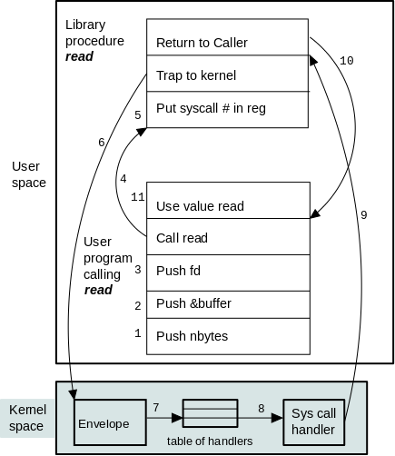
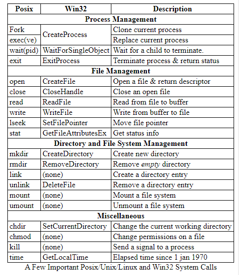
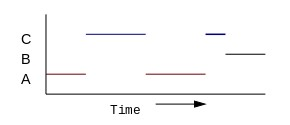

### CSCI-UA.202: Operating Systems

#### Prof. Allan Gottlieb, Spring 2021

_PROGRAMMING LANGUAGE IS C/C++_

# Table of Contents

| Section | Title |
| ------- | ----- |
| 01 | [Intro](#01) |
| 02 | [Process & Thread Management](#02) |

# Introduction

- __Virtual machine:__ software emulation of some hardware. 
    - makes it look like the hardware has the features you like (eg, TCP/IP)
    - makes the process think it has all the memory, cpu, hardware etc. 
    - provides portability, eg, Java.

Virtual machine abstraction:
1. apps and utilities
2. UI
3. libraries
4. the OS proper (kernel)
5. hardware

Kernel runs in __privileged/supervisor__ mode. Programs and others run in __user__ mode. Programs will call to the kernel to perform I/O.

Kernal layers:
1. (Machine independent) files and filesystems.
2. (Machine independent) I/O.
3. (Machine dependent) device drivers.

## What is an Operating System

Raises abstraction (see above)

*Resource manager:* the Central Processing Unit (CPU/processor) can only work on one process at a time. OS manages which processes to run.

## History of Operating Systems

__Batch OS:__ similar jobs (processes) grouped in batches and completed together. *uniprogrammed*

Sometimes a job would need to leave the CPU to whatever reason. Waiting CPU is idle, inefficient.

__Multiprogramming:__ no longer the need to wait for a job to finish. Starts on the next job until the original job returns. *Time-sharing* is multiprogramming with rapid switching between jobs, giving the impression of multiple jobs running simultaneously.

*Difference between multiprogramming and multiprocessing???* They're pretty similar. Don't confuse it with multiprocessor.

## Computer Hardware Review
<!-- elaborate? -->

__bus:__ a set of wires that connect two or more devices.

__trap:__ assembly instruction that switches (jumps) from user to kernal mode.

## System Calls

User directly interacts with the OS (ex. `read()`). This is done using trap.

Below are a few syscall commands/functions:

## Operating System Structure

Everything inside the dotted line is part of the OS:

__Monolitic approach:__ one big program, like above. Too fat, makes implementation and maintainance hard.

__Layered approach:__ Top layer is UI, middle is OS, bottom is hardware. The programmer is responsible for designing which component goes into what layer.

__Microkernals:__ Have the kernal (the supervisor mode) as small as possible. All other components are implemented on user level. Kernal acts just as a messenger. Good to prevent crashes.

__Client-server:__ Good for *distributed systems*, storing lots of data. Allows one computer to send operating system code to another computer.

## Metric Units

- nano = 10^-9 or 2^-30
- micro = 10^-6 or 2^-20
- milli = 10^-3 or 2^-10
- kilo = 10^3 or 2^10
- mega = 10^6 or 2^20
- giga = 10^9 or 2^30
- tera = 10^12 or 2^40

# Process & Thread Management

## Processes

__Process:__ program in execution

Each process thinks that its always running, has all the memory, etc. (due to abstraction)

In reality, multiprogramming switches between processes really fast. 

Process creation:
1. System initialization, including daemon (see below) processes.
2. __Execution of a process creation system call (e.g., `fork()`) by a running process.__
3. A user request to create a new process.
4. Initiation of a batch job.

__Daemon__ processes work in the background.

Process termination:
1. Normal exit (voluntary).
2. Error exit (voluntary).
3. Fatal error (involuntary).
4. Killed by another process (involuntary).

`kill()` and `exit()`

__Process States & Transitions__

*Ready:* ready to be put into the CPU

*Running:* CPU is currently working on it

*Blocked:* waiting on some event (resource becoming available, I/O operation, etc.)

A microkernel has a *scheduler, interrupt handler,* and *inter-process communication (IPC)* to work on processes.

Interupts are hard to reproduce and hard to log. 

## Threads

__thread:__ independent sequence of operations being performed by the processor. Aka *lightweight processes*

One processor can have multiple threads, switching threads is much faster than switching processes. No limit to the amount of threads that can be created.

Threads within the same process share memory.

## Process Scheduling

*If you have several waiting processes, which one do you pick to run?*
