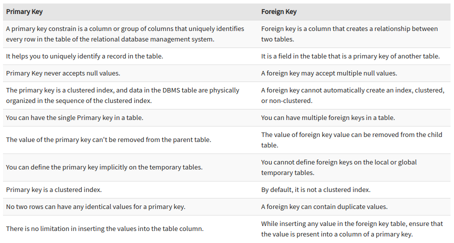
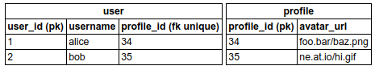

### CSCI-UA.479: Data Management & Analysis

#### Prof. Joseph Versoza, Spring 2021

*PRETTY MUCH EVERYTHING IS DONE IN PYTHON*

# Table of Contents

| Section | Title |
| ------- | ----- |
| 01 | [Unicode & Strings](#01) |
| 02 | [Functions & Functions as Objects](#02) |
| 03 | [List Comprehension, Looping, Iterables](#03) |
| 04 | [Data File Formats](#04) |
| 05 | [Stats & Stats Libraries](#05) |
| 06 | [Regular Expressions](#06) |
| 07 | [Screen Scraping](#07) |
| 08 | [Databases Intro](#08) |
| 09 | [Basic Postgres](#09) |
| 10 | [Constraints & Joins](#10) |
| 11 | [Database Design](#11) |
| 12 | [Strings & Arrays in Postgres](#12) |
| 13 | [Postgres Performance Optimization](#13) |
| 14 | Python & Postgres |

<a id="01"></a>
# Unicode & Strings

*Python protip:* use `int('100', 2)` and `format(4, 'b')` to convert binary to decimal and decimal to binary

Unicode is a concept. Idea behind it is to cover the entire world's characters (emojis 😂, languages 中文, etc).

1. mapping number to char
	- ASCII
	- Unicode
2. the actual way we do that... is encoding
	- ASCII (7 bits, 8 for extended)
	- UTF-8 (1 to 4 bytes)
		- 1st byte determines the no. of bytes
		- 1110xxxx 10xxxxxx 10xxxxxx
	- UTF-16 (2 bytes or 4 bytes)
	- UTF-32 (4 bytes)
	- many others...

It could be hard to know how a file is encoded. Thats why it's often specified in the HTML header in webpages.

UTF-8 is backwards compatable w/ ASCII, utf-8 is most popular.


### String Formatting

`"Hi, my name is {2:s}, and I have {0:.2f} {1:s}!".format(20, 'apple pies', 'joe')`

Prints out 'Hi, my name is joe, and I have 20.00 apple pies!'

*f-strings*: a less verbose version of `str.format()`, introduced in Python 3.6

<a id="02"></a>
# Functions & Functions as Objects

\* in fuctions turns arguments into a tuple and ** turns args into dictionarys

you can preset arguments into default values

### Classes

Double underscore methods (aka magic methods) are special, here are some examples

1. \_\_init__(self, ...): constructor
2. \_\_str__(self): called when instance is converted to str (human readable)
3. \_\_repr__(self): string representation for debugging (for example), evaluating in interactive shell
4. \_\_eq__(self, other): specifies how `==` behaves (what is necessary for two instances to be equal?)
5. ([more online](https://docs.python.org/3/reference/datamodel.html#special-method-names) for documentation)

Static methods will need a __decorator__ `@staticmethod` to identify is as such

<a id="03"></a>
# List Comprehension, Looping, Iterables

list comprehension - `[i for i in range(50) if i > 5]`

`enumerate()` allows you to index and iterate at the same time

### Iterators & Generators

Every iterable has an implemented `__next__`

Every generator is an iterable, but not vice versa. Generators also cannot go backwards.

Generator uses `yield`, like returning and pausing a function in the middle.

generator comprehension uses parentheses instead of brackets - `(i for i in range(50))` 

<a id="04"></a>
# Data File Formats

TXT, CSV, XML, JSON

unstructured data: books, images, health records, etc.

- CSV can be read with `split(',')` but you need to be careful about commas in text. Therefore, check for \ escapes in text.
	- `import csv` and `csv.reader()` or `csv.DictReader()` handles in-text commas

When you find data you should
1. document where it came from
2. figure out what its license is 
3. document when you retrieve it
4. determine how it was collected / critical thinking about methodology

<a id="05"></a>
# Stats & Stats Libraries 

1. range `max` minus `min`
2. central tendancy
	- mean
	- median
	- mode
3. dispersion 
	- stdev
	- mean abs deviation (MAD)

## NumPy

`import numpy as np`

Implemented in C, so it's fasttt

### Arrays

*numpy arrays* - same data type, fixed size (can be reshaped tho - `arr.shape = (3, 3)`). Overall easier to perform operations on

- Ways to create arrays:
	- `np.array(list)`
	- `np.arange(val)`
	- `np.ones(shape)`, `np.zeros(shape)`

Indexing with tuples (??)

Assignment changes all elements (vectorized)

`axis=0` is columns, `axis=1` is rows

## Matplotlib

`import matplotlib.pyplot as plt`

- `plt.plot(x, y)` makes a simple graph. `plt.subplot()` for multiple displays
	- can customize the color, line pattern, xtick, ytick, labels, etc...
	- can add multiple lines

`plt.bar()` is a bar chart

`plt.scatter()` scatter plot

## Pandas

`import pandas as pd`

Numpy, but tabular

- Data types:
	- __Series__, dictionary with ordered key/val pairs and duplicates. Like the LabeledList made for HW
		- created by `pd.Series()`. Pass in list, dict, 
		- comparisons
		- filtering with booleans
	- __DataFrame__, a table. Like the Table made for HW
		- create by `pd.DataFrame()`
	- __Index__

little to no streaming, not friendly w/ big data

### Joining Data

`pd.merge()` joins databases based on common column values

`pd.concat()` joins rows together

### Data Aggregation

`pd.DataFrame.set_index()` turns column(s) into index(es)

`pd.DataFrame.groupby()` groups data together, the grouped value becomes the index (?), ex `df['Salary'].groupby(df['Year']).mean()`

<a id="06"></a>
# Regular Expressions (Regex)

`import re`

- Searching for a *pattern* in a string
	- has more functionality than `in` or `split()` since those guys have to search for a *target string*

Regex is common accross other languages (invented in the 1950s)

Common functions include: `re.match(pattern, string)`, `re.search()`, `re.findall()`, `re.split()`

Syntax for... character classes:


Location:


Quantifiers:


Pandas has built in regex functions `str.match(pattern)` and `str.extract(pattern)`. The latter must contain subgroups.

<a id="07"></a>
# Screen Scraping

### Data Formats on the Web

Most of the web's data is hierarchical (html, xml, json)

- pain in the ass to parse
	- *SOLUTION:* find a library that parses it for you
		- [beautiful soup 4](http://www.crummy.com/software/BeautifulSoup/bs4/doc/)
		- [scrapy](https://scrapy.org/)
		- [requests-html](https://requests.readthedocs.io/projects/requests-html/en/latest/)

`import json` converts betwen JSON and dictionaries

### Making Web Requests, Using APIs

HTTP/HTTPS - Hypertext Transfer Protocol (Secure)

- Web basics
	- http: client, server
	- http request: GET/POST
	- http response: status
	- url: domain, path

Can use `import requests` or `import urllib.request` to retrieve url data

__Application Programming Interface (API):__ a set of tools that helps you develop an application


<a id="08"></a>
# Databases Intro

Database users work with data through a GUI or command line queries (pgAdmin, DataGrip, psql, etc.)

- __Database Management System (DBMS):__ software that allows users to *define, create, query, and administer* a database
	- often though, databases and DBMS are used interchangeably
- __Client / Server:__ clients requests database services, servers provide
	- client and server can exist on the same computer!!
	- server can exist as one central unit, a cluster of servers (possibly on the same comp), or distributed in different locations

__Structured Query Language (SQL):__ standardized programming language between relational databases

__Relational Database:__ storing data in tables (relations), non-relational is everything else

Non-relational examples:
1. key-value
2. document
3. graph
4.  newSQL

How are Pandas and relational databases SIMILAR?
- Both use tables that are relational

How are Pandas and relational databases DIFFERENT?
- __Pandas:__
	- doesn't actually store data (just loads into RAM)
	- functions designed for statisical analysis (?)
	- entirety of Python ecosystem available
- __Databases:__
	- multi-client access and authentication
	- declarative language SQL
	- transactions (ACID)
	- replication, logging, clustering, etc.

<a id="09"></a>
# Basic Postgres

*PostgreSQL* is a hybrid object-relational database

templates → databases → schemas → tables → views

A lot of data types (some are listed below) 


## psql Client

Common psql commands:


\\i for running scripts

\\? for additional documentation

### SQL syntax

identifiers (aka variables) - case sensitive iff quoted

keywords - case insensitive, but uppercase is the convention

Some essentials:

```sql
-- CREATE - makes stuff
CREATE TABLE table_name (
    col1 dataType, 
    col2 dataType
);

-- SELECT - reading/filtering
SELECT column_name FROM table_name WHERE condition;
SELECT DISTINCT;

-- UPDATE - updates data in row(s), be careful when doing this bc there's no undo

-- DELETE - removes row(s)
DELETE FROM table_name WHERE condition;

-- ALTER - alter cols, tables, etc.
ALTER TABLE table_name ADD column_name dataType;

-- ORDER BY - sorting
SELECT * FROM table_name
ORDER BY column_name DESC NULLS LAST;

-- casting, postgres specific
CAST(column_name AS newType);
val::newType;

-- importing data, postgres specific
COPY table_name FROM { 'filepath' | PROGRAM 'command' | STDIN } WITH (option, ...);
```

.sql scripts also exist

<a id="10"></a>
# Constraints & Joins

__Constraints:__ additional rules put on the either the entire table or a specific column
1. Check Constraints - generic conditional
2. Not-Null Constraints - self explanatory
3. Unique Constraints - only unique entries
4. Primary Keys - column(s) that identify a row, uniqrue and not-null
5. Foreign Keys - relates columns between tables, finds common values
	- a foreign key can reference *more than one* columns
	- *Does a foreign key have to reference a primary key?* It is convention to reference to a primary key, but if you must reference to a non-primary key, the column AT LEAST has to have a UNIQUE constraint.



Foreign key example:
```sql
-- parent table
-- CREATE TABLE students ( 
--   student_id serial PRIMARY KEY,
--   player_name text
-- );

-- inline
CREATE TABLE tests ( 
   subject_id serial,
   subject_name text,
   highestStudent_id int REFERENCES students(student_id)
);

-- out of line
CREATE TABLE tests ( 
  subject_id serial,
  subject_name text,
  highestStudent_id int, 
  CONSTRAINT fk_tests_students
     FOREIGN KEY(highestStudent_id) 
     REFERENCES students(student_id)
);
```

__Joins:__ joining columns/tables together
1. Cross Join - rows from one table combined with each row from another table, n * m rows total
2. ___Inner Join___ - joining rows based off common column values
3. (Left/Right/Full) Outer Join - inner join, but including everything on the (left/right/both) table(s)

### Table Relationships

one to many (foreign keys are on the *many side* of one to many)


one to one (putting a UNIQUE constraint on foreign key)



many to many (creating a __join table__ to minimize duplicating rows)


<a id="11"></a>
# Database Design

__entity:__ some *\*thing\** that we store data about (basically a table)  
__weak entity__ must be related to another entity to exist  
__composite entity__ models the relationship between other entities (basically a join table in a many to many relationship)  

__attribute:__ data that describes an entity (basically columns)

__instance__ of an entity is basically a row

_relation:_ a two-dimensional table consisting of columns and rows, with only one value at the intersection of a column and row

_composite key:_ two or more columns in a table that uniquely identify a row in that table; no part of a composite key may be null

_entity identifier:_ an attribute or attributes that uniquely identify an instance of an entity

_data model:_ specifies the data and relationships to a DBMS; The actual implementation may vary based on the DBMS, so the data model is independent from the DBMS that is being used.

Entity Relationship Diagrams (__ER Diagrams__):
1. Chen
2. Crow's Feet


Tools such as [pgModeler](https://www.pgmodeler.io/) help you design and export databases.

## Normalization

__Normalization:__ process of structuring a relational database to 1) reduce redundant data, and 2) avoid insert, update and delete anomalies

### 1st Normal Form

Each cell is single-valued

Each attribute has only one type

Instances are uniquely identified by a key

### 2nd Normal Form

All non-key attributes are dependant on the entire key

### 3rd Normal Form

All attributes can only be determined by the key and no other column

### Summary

_"Within any given entity, every attribute is dependant the key, the whole key, and nothing but the key."_

- 1NF: "the key" implies that the key exists
- 2NF: "the whole key" is a reference to no partial dependencies
- 3NF: "nothing but the key" means that it doesn't depend on non-key attributes

Don't worry about 4NF and 5NF too much...

<a id="12"></a>
# Strings & Arrays in Postgres

## Strings

`char_length` finds char length of a string

Splitting strings: `string_to_array(text, delimiter)` and `regexp_split_to_array(text, pattern)`

Casing and whitespace: `upper`, `lower`, `initcap`, `trim(ltrim, rtrim)`

Aggregating strings: `string_agg(col_name, join_string)`

## Arrays

Postgres __[Array type](https://www.postgresql.org/docs/current/arrays.html)__ is 1-indexed and single-typed  
Declared like `col_name int[]`  
Create one on the fly like this: `ARRAY['foo', 'bar', 'baz']`

`array_length` takes two args, the target array and the no. of dimensions

Some array operations:
1. concat - `select array[1, 2, 3] || array[4, 5];`
2. contains subarray - ` select array[1, 2, 3] @> array[2, 3];`
3. python's `str.join()` - `array_to_string(array[1.0, 2], '-');`
4. convert to rows - `select unnest(array[1, 2, 3]);`
5. etc...

ANY checks for existence in any part of the array:  
`SELECT terms FROM table_name WHERE 'foo' ilike ANY(string_to_array(terms, ','));`

<a id="13"></a>
# Postgres Performance Optimization

In general you wanna minimize the amount of time your machine spends searching, so the way you write your queries matter.

Adding `EXPLAIN` before your query breaks down the steps that Postgres will use to execute it.

Adding `EXPLAIN ANALYZE` both explains and runs the query.

```
postgres=# EXPLAIN ANALYZE SELECT * FROM web_user WHERE first='tegan';

Gather  (cost=1000.00..5739.49 rows=124 width=78) (actual time=10.928..185.362 rows=149 loops=1)
  Workers Planned: 2
  Workers Launched: 2
  ->  Parallel Seq Scan on web_user  (cost=0.00..4727.09 rows=52 width=78) (actual time=8.456..173.988 rows=50 loops=3)
        Filter: ((first)::text = 'tegan'::text)
        Rows Removed by Filter: 83284
Planning time: 1.319 ms
Execution time: 187.264 ms
(8 rows)
```

*Note: `EXPLAIN` is postgres specific*

### Making Shit Fastttttt

Adding __indexes__ to columns, exchanges space for less time  
(adds a *B-Tree* to speed up searches in the target column)

*Note: Indexing helps for retrieving just a few rows, but might not be efficient when retrieving a majority of the rows...*

