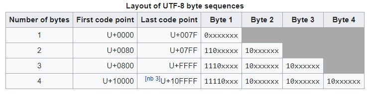

### CSCI-UA.479: Data Management & Analysis

#### Prof. Joseph Versoza, Spring 2021

*PRETTY MUCH EVERYTHING IS DONE IN PYTHON*

# Unicode and Strings

*Python protip:* use `int('100', 2)` and `format(4, 'b')` to convert binary to decimal and decimal to binary

Unicode is a concept. Idea behind it is to cover the entire world's characters (emojis, languages, etc).

1. mapping number to char
	- ASCII
	- Unicode
2. the actual way we do that... is encoding
	- ASCII (7 bits, 8 for extended)
	- UTF-8 (1 to 4 bytes)
		- 1st byte determines the no. of bytes
		- 1110xxxx 10xxxxxx 10xxxxxx
	- UTF-16 (2 bytes or 4 bytes)
	- UTF-32 (4 bytes)
	- many others...

It could be hard to know how a file is encoded. Thats why it's often specified in the HTML header in webpages.

UTF-8 is backwards compatable w/ ASCII, utf-8 is most popular.

### String Formatting

`"Hi, my name is {2:s}, and I have {0:.2f} {1:s}!".format(20, 'apple pies', 'joe')`

Prints out 'Hi, my name is joe, and I have 20.00 apple pies!'

*f-strings*: a less verbose version of `str.format()`

### Functions and Functions as Objects

\* in fuctions turns arguments into a tuple and ** turns args into dictionarys

you can preset arguments into default values

### Classes

Double underscore methods (aka magic methods) are special, here are some examples

1. \_\_init__(self): constructor
2. \_\_str__(self): called when instance is converted to str (human readable)
3. \_\_repr__(self): string representation for debugging (for example), evaluating in interactive shell
4. \_\_eq__(self): specifies how `==` behaves (what is necessary for two instances to be equal?)
5. (more online for third party documentation)

Static methods will need a __decorator__ `@staticmethod` to identify is as such

### List Comprehension, Looping, Iterables

list comprehension - `[i for i in range(50) if i > 5]`

`enumerate()` allows you to index and iterate at the same time

### Iterators and Generators

Every generator is an iterable, but not vice versa. Generators also cannot go backwards.

`yield`, like pausing a function??

### Data File Formats

TXT, CSV, XML, JSON

unstructured data: books, images, health records, etc.

When you find data you should
1. document where it came from
2. figure out what its license is 
3. document when you retrieve it
4. determine how it was collected / critical thinking about methodology

