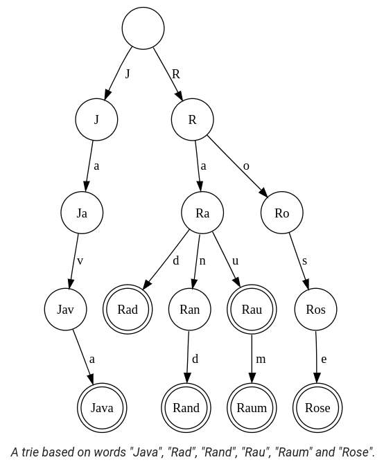

## Data Structures & Algorithms

*TIPS, TRICKS, AND TECHNIQUES ON ALL THINGS DATA & ALGO*


| Table of Contents |
| ----------------- |
| [Binary & Ternary Search](#binary_and_ternary_search) |
| [Topological Sort](#topological_sort) |
| [Dynamic Programming](#dynamic_programming) |
| [Union Find](#union_find) |
| [Segment Tree](#segment_tree) |
| [Trie](#trie) |
| [Bit Manipulation](#bit_manipulation) |


# <a id="binary_and_ternary_search"></a> Binary Search & Ternary Search

Binary search is used to find a target value in a ***monotonic*** dataset by repeatedly *HALVING* the search interval, while ternary search divides the interval into *THREE* parts to find the min or max in ***unimodal*** functions.

## Binary Search

[Reference Link](https://www.topcoder.com/community/competitive-programming/tutorials/binary-search) <br/>
[Practice Problem](https://codeforces.com/edu/course/2/lesson/6/1/practice/contest/283911/problem/A)

Only works if the ordered data is either constantly increasing or decreasing (non-changing is fine too). <br/>
If the condition is viewed as a boolean return and the data looks like this (FFFFFFFTTTTTTT), then binary will work.

```python
def binary_search():
    lo = min_possible_val - 1
    hi = max_possible_val + 1

    while lo != hi - 1:  # lo and hi will converge until they are next to each other
        mid = lo + (hi - lo) // 2  # same as (lo + hi) // 2, but prevents integer overflow

        if f(mid) == True:
            hi = mid  # can also set this to lo based off of needs
        else:
            lo = mid

    return lo  # return lo or hi based off of needs
```

Time complexity - O(log n)

### Calculating `mid`

Proving that `(lo + hi) // 2 == lo + (hi - lo) // 2`


### Indexing

If `hi != lo`, then there will always be a point in the search where `lo == hi - 1`

For most cases, you never want `lo = 0` and `hi = n - 1` because if `n = 1` then `0 == n - 1`

## Ternary Search

Binary search, but with three pointers instead of two


# <a id="topological_sort"></a> Topological Sort

Topological sort is a linear ordering of vertices in a directed acyclic graph (DAG) such that for every edge `u -> v`, `u` appears before `v` in the ordering.

Mainly used for detecting cycles in a DAG

### Sample Problem: Detect Cycle in a DAG

Input:  
`n` -> number of nodes  
`edges` -> a list of edges that make up the graph

Output:  
A boolean indicating if a cycle exists  
A list representing a valid topological order

#### BFS Approach (Kahn's Algorithm)

This approach is ***more popular*** and arguably ***easier*** to implement.

```python
def topSortKahn(n, edges):
    # Step 1: Create the adjacency list and in-degree array
    children = [[] for _ in range(n)]
    inDegree = [0] * n

    for u, v in edges:
        children[u].append(v)
        inDegree[v] += 1

    # Step 2: Initialize the queue with nodes having in-degree of 0
    queue = [i for i in range(n) if inDegree[i] == 0]

    # Step 3: Traverse graph topologically
    for node in queue:        
        for child in children[node]:
            inDegree[child] -= 1
            if inDegree[child] == 0:
                queue.append(child)

    # Step 4: Check if the topological sort includes all nodes
    if len(queue) == n:
        return False, queue  # No cycle detected, return the topological order
    else:
        return True, []  # Cycle detected, return an empty list
```

#### DFS Approach

Note that the topological order does not need to be generated for DFS to detect a cycle.

```python
def topSortDfs(n, edges):
    # Step 1: Create an adjacency list
    children = [[] for _ in range(n)]

    for u, v in edges:
        children[u].append(v)
    
    # Step 2: Initialize visited and recursion stack
    visited = [False] * n
    recStack = [False] * n
    topOrder = []
    
    def dfs(node):
        if recStack[node]:
            return True  # Cycle detected
        if visited[node]:
            return False  # Node already processed
        
        visited[node] = True
        recStack[node] = True
        
        for child in children[node]:
            if dfs(child):
                return True
        
        recStack[node] = False
        topOrder.append(node)
        return False
    
    # Step 3: Check for cycles and build the topological order
    for node in range(n):
        if not visited[node]:
            if dfs(node):
                return True, []  # Cycle detected, return empty topological order
    
    return False, topOrder[::-1]  # No cycle detected, return reversed topological order
```

Time complexity - O(Vertices + Edges)  
Space complexity - O(Vertices + Edges)


# <a id="dynamic_programming"></a> Dynamic Programming (Memoization)

Saving values so you don't need to recalculate them  
DP is a form of **caching**

To solve a DP problem, all you need to know is the **state** and **transition**:
- state: the set of properties that *IDs* the value you are storing
- transition: how to calculate the value from previously saved values

## Popular Problems

### Knapsack

Given a knapsack and an array of items with weights, determine if you can fill the knapsack completely (each item can only be chosen once).

```python
def knapsack(items, maxSize):
    n = len(items)
    dp = [0] * (maxSize + 1)
    
    dp[0] = 1
    for i in range(n):
        for j in range(maxSize, items[i]-1, -1):
            dp[j] |= dp[j - items[i]]  # bitwise OR

    return dp[maxSize]
```

Time complexity - O(n\*m) where n is item length, m is maxSize <br/>
Space complexity - O(m)

NOTE: If items can be chosen multiple times, then flip the direction of the second loop.


# <a id="union_find"></a> Union Find (Disjoint Set)

Groups elements together and finds which element belongs to what group.

```python
n = len(some_array)
parent = [i for i in range(n)]  # all elements initially in their own group

def union(x, y):
    parent[find(x)] = find(y)

def find(x):
    if parent[x] != x: parent[x] = find(parent[x])  # finds the root and compresses the branch
    return parent[x]
```


# <a id="segment_tree"></a> Segment Tree

[Practice Problem](https://codeforces.com/edu/course/2/lesson/4/1/practice/contest/273169/problem/A)

What is it? _It's a tree of segments dumbasssss_

Great for range queries

Say this is your array: `[3, 1, 2, 5, 6, 8, 3, 2]`

Then this would be your segment tree of sums:


The total number of nodes will always be to the power of 2 b/c it's a binary tree <br/>
If the original length of the array is not a power of 2, just pad the tree with zeros

There are different implementations. This is the most readable:

```python
segtree_n = 2 ** 17  # usually this amt of nodes is enough
segtree = [0] * 2 * segtree_n

def set(i, v, x=0, lo=0, hi=segtree_n):
    if hi - lo == 1:  # reached the bottom
        segtree[x] = v;
        return

    mid = (lo + hi) // 2
    if i < mid:
        set(i, v, 2*x+1, lo, mid)
    else:
        set(i, v, 2*x+2, mid, hi)

    segtree[x] = segtree[2*x+1] + segtree[2*x+2]  # operation changes based off needs


def get(target_lo, target_hi, x=0, lo=0, hi=segtree_n):
    if target_lo >= hi or target_hi <= lo: return 0  # range is out of bounds
    if target_lo <= lo and target_hi >= hi: return segtree[x]  # range is in bounds

    mid = (lo + hi) // 2  # range is partially in bounds
    a = get(target_lo, target_hi, 2*x+1, lo, mid)
    b = get(target_lo, target_hi, 2*x+2, mid, hi)

    return a + b  # again, operation changes
```

Setting/updating a value takes O(log n) time <br/>
Getting a segment takes O(log n) time

## Lazy Propagation

Sometimes you don't just want to update one value at a time. Sometimes you want to update a _range_ of values.

w/o lazy prop it'll take O(nlog n) time. _TOO SLOW!!!_ w/ lazy prop it'll take O(log n)


# <a id="trie"></a> Trie (Prefix Tree)

[Practice Problem](https://leetcode.com/problems/implement-trie-prefix-tree/)

It is called a trie b/c it's a re***TRIE***val data structure

What is it? _A tree, duh. Each node builds its value on top of its parent. Hence the alt name PREFIX tree._

Often used to store strings (words), but not limited to it.



Can't a hashtable do the same thing? _Yeah but hashtables can't search efficiently based off prefix. What if I wanted all words beginning in 'inter-'?_

```python
class TrieNode:
    def __init__(self):
        self.children = {}
        self.is_word = False

root = TrieNode()

def insert(word):
    node = root

    for ch in word:
        if ch not in node.children:
            node.children[ch] = TrieNode()
        node = node.children[ch]

    node.is_word = True


def search(word):
    node = root

    for ch in word:
        if ch not in node.children:
            return False
        node = node.children[ch]

    return node.is_word


def startsWith(prefix):
    node = root

    for ch in prefix:
        if ch not in node.children:
            return []
        node = node.children[ch]

    return findAll(node, [ch for ch in prefix])


def findAll(node, word, res=None):
    if res == None: res = []
    if node.is_word: res.append(''.join(word))

    for ch, child in node.children.items():
        word.append(ch)
        findAll(child, word, res)
        word.pop()

    return res
```

Inserting is O(n), where n is the length of the word <br/>
Searching is O(n)


# <a id="bit_manipulation"></a> Bit Manipulation

Both AND (`&`) and OR (`|`) are destructive, but XOR (`^`) and NOT (`~`) are reversible.
