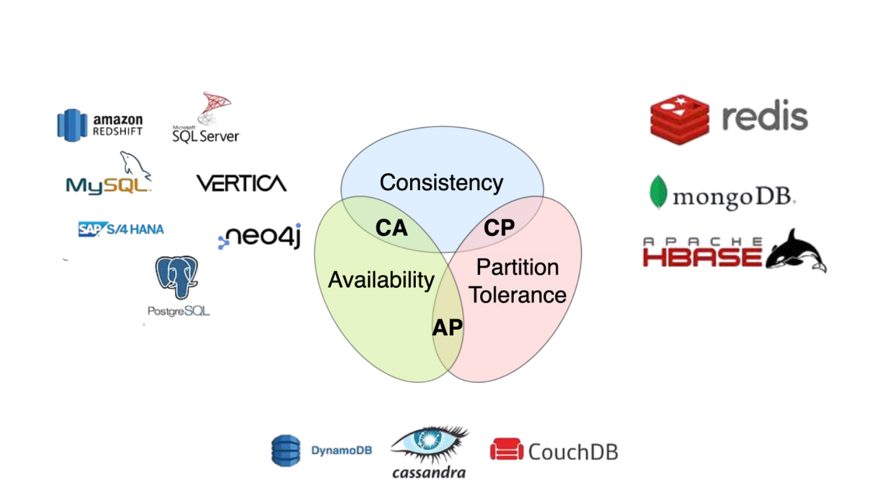

## System Design

| Table of Contents |
| ----------------- |
| [Intro](#intro) |

#  Intro

What is a system?

You must walk through how you can build something so that it:

1. ***Works*** - makes sense in terms of implementation and maintainability
2. ***Scales*** - can handle lots of users and data 
3. ***Is reliable*** - rarely fails and recovers gracefully when it does fail
4. ***Is secure, is low cost, etc...***

# WIP

- CAP theorem

 

- Databases
    - sql vs nosql
        - postgres, mongo, cassandra, redis
    - replication, sharding (diff from partitioning)
    - object stores
- Client <> Server Communication
    - REST
    - Polling
    - WebSockets
    - Server Side Events
- Load balancer
- Queue
    - kafka, rabbitmq
- Events
- Other tools
    - Flink, elasticsearch, nginx (?)
    - aws s3, lambda
